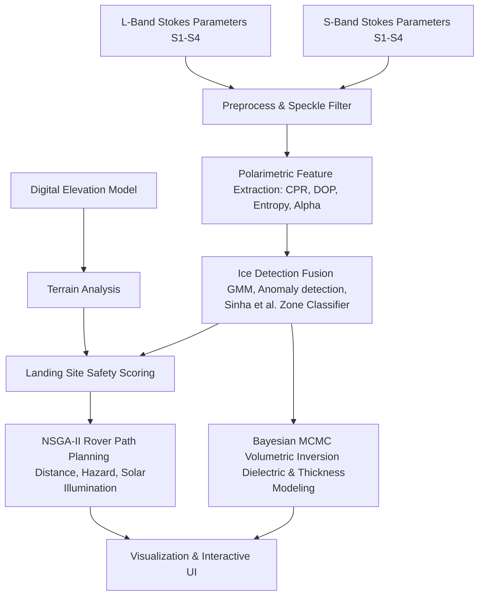

# LunarIce-360

**LunarIce-360** is an end-to-end mission planning and scientific processing pipeline for lunar water ice detection, volumetric estimation, landing site selection, and multi-objective rover traversal optimization. The pipeline is designed to work with dual-frequency (L-band and S-band) polarimetric Synthetic Aperture Radar (SAR) data, such as those from Chandrayaan-2's Dual Frequency SAR (DFSAR).

---

## Architecture & Pipeline Flow

The processing flow from raw SAR inputs to optimized rover traversal and volumetric estimation:



---

## Key Modules & Pipeline Steps

### 1. Preprocessing (`preprocessing.py`)
- Filters speckle noise using a modified **Lee Speckle Filter** on Stokes parameters ($S_1, S_2, S_3, S_4$).
- Computes spatial averages for coherent matrix calculations.

### 2. Polarimetric Feature Extraction (`polarimetry.py`)
- Computes **Circular Polarization Ratio (CPR)** and **Degree of Polarization (DOP)**.
- Builds the $2 \times 2$ wave coherency matrix $[J]$.
- Performs **Cloude-Pottier Eigenvalue Decomposition** to extract scattering **Entropy ($H$)**, **Anisotropy ($A$)**, and average scattering angle **Alpha ($\alpha$)** for scattering mechanism identification.

### 3. Ice Detection Fusion (`ice_detection.py`)
- Fuses multiple heuristic and machine learning methods:
  - **Thresholding**: Traditional criteria (CPR > 1.0, DOP < 0.13 indicating volume scattering).
  - **Cloude-Pottier H-Alpha Zones**: Sinha et al. (2026) classification.
  - **Gaussian Mixture Models (GMM)**: Clustering polarimetric signatures.
  - **Isolation Forest**: Detecting anomalies relative to typical dry lunar regolith.

### 4. Terrain & Shadow Analysis (`terrain.py` & `landing_site.py`)
- Calculates slopes and **RMS surface roughness** from the Digital Elevation Model (DEM).
- Estimates solar illumination fractions and shadow patterns.
- Scores candidate landing sites using a multi-attribute utility function weighting safety, illumination, flatness, and proximity to detected ice.

### 5. Multi-Objective Rover Traverse Path Planning (`traverse.py`)
- Optimizes rover traversals using the **NSGA-II genetic algorithm**.
- Optimizes paths across three concurrent objectives:
  1. Minimize path length.
  2. Minimize slope and hazard exposure.
  3. Maximize solar illumination for battery charging.
- Integrates physical constraints including rover speed, power generation, and communication limits.

### 6. Volumetric Ice Inversion (`volume_estimation.py`)
- Uses **Bayesian MCMC (Markov Chain Monte Carlo)** to invert physical parameters from SAR backscatter.
- Estimates ice fraction, layer thickness, density, and roughness.
- Produces confidence bounds and corner plots showing parameter correlations.

---

## Installation & Setup

1. **Clone the repository:**
   ```bash
   git clone https://github.com/yashs00/BAHood.git
   cd BAHood
   ```

2. **Set up a virtual environment (optional but recommended):**
   ```bash
   python -m venv .venv
   # Windows:
   .venv\Scripts\activate
   # macOS/Linux:
   source .venv/bin/activate
   ```

3. **Install dependencies:**
   Ensure you have the required scientific libraries installed (NumPy, SciPy, Matplotlib, scikit-learn, emcee, corner).

---

## Running the Pipeline

### Option 1: Run the Synthetic Demo Pipeline
Run the fully self-contained simulation which generates a synthetic crater terrain, injects ice signatures, runs the entire detection, site selection, NSGA-II traversal optimization, and MCMC volume estimation:
```bash
python -m lunarice360.demo_synthetic
```
All generated heatmaps, path maps, MCMC corner plots, and logs are saved in the `outputs/` folder.

### Option 2: Run the Web UI App
Run the local HTTP server to launch the pipeline from your web browser:
```bash
python -m lunarice360.ui_app
```
Once started, navigate to `http://localhost:8000` in your web browser.

---

## Project Structure

```
BAHood/
│
├── lunarice360/
│   ├── __init__.py
│   ├── config.py              # Configuration & Physical Constants
│   ├── data_loader.py         # GeoTIFF and PDS dataset loaders
│   ├── preprocessing.py       # Speckle filtering (Lee filter)
│   ├── polarimetry.py         # Stokes & Cloude-Pottier features
│   ├── ice_detection.py       # Heuristics & Machine Learning Fusion
│   ├── terrain.py             # Slope & Roughness analysis
│   ├── landing_site.py        # Safety & Proximity scoring
│   ├── traverse.py            # NSGA-II rover path planning
│   ├── volume_estimation.py   # MCMC thickness & volume estimation
│   ├── visualization.py       # Grid plotting & Corner plots
│   ├── ui_app.py              # Local Web UI launcher
│   └── main.py                # Pipeline orchestrator
│
├── tests/                     # Smoke tests
├── .gitignore
└── README.md
```
